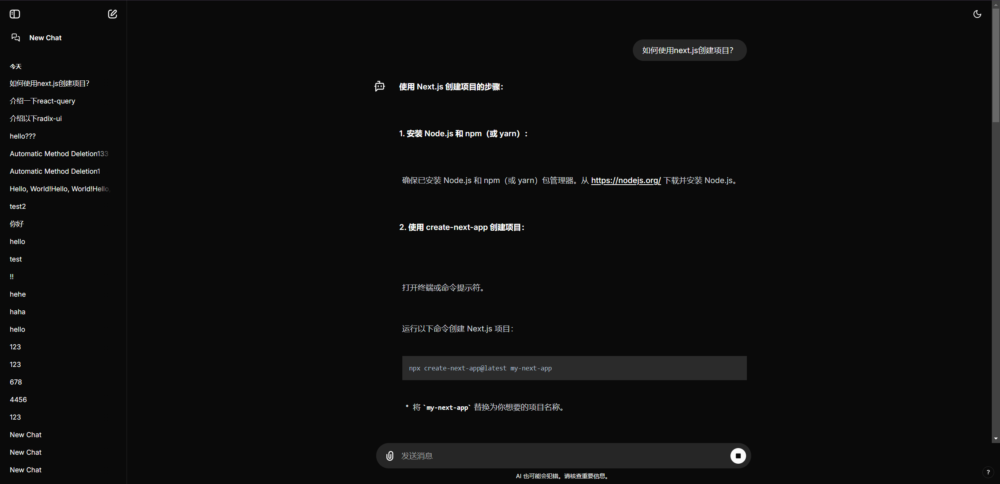

# Z-AI-Chat

此项目是一个全栈 AI 聊天应用，项目使用`next.js` 和 `prisma`构建，使用 [Gemini API](https://ai.google.dev/gemini-api/docs/api-key) 生成对话:

- `Next.js`
- `Prisma`
- `TailwindCSS`
- `ReactQuery`
- `Radix UI`
- `Generative-ai-js`



## 开始

### 安装依赖

```bash
yarn install
```

### 添加环境变量

添加 `.env` 文件

```bash
cp .env.example .env
```

修改 `.env` 文件

```bash
# .env
DATABASE_URL="" # 数据库连接地址，使用 sqlite 时，可以设置为 file:./dev.db

GOOGLE_GEN_API_KEY="Your Google API Key" # 确保使用可用的 Google API Key

LOCAL_PROXY_URL="http://127.0.0.1:8080" # 如果需要使用代理访问 Google API，请设置代理地址

MOCK_MESSAGE="Hello, World!" # 模拟消息，用于调试，配置此项时，不会调用 Google API
```

### 设置数据库

支持 sqlite、postgresql

```prisma
datasource db {
  provider = "postgresql"
  url      = env("DATABASE_URL") // uses connection pooling
}
```

```bash
npx prisma db push
```

### 运行项目

```bash
yarn dev
```

## Roadmap

- [x] 基本功能、UI、后端、数据库

- [x] UI 重构，主题切换

- [x] 历史标题列表的懒加载

- [x] 标题的编辑和删除功能

- [ ] 对话的编辑、重新生成和内容复制

- [x] 消息页面滚动优化和 Markdown 区域样式优化

- [x] 部署到 Vercel

- [ ] 更多的对话生成模型

- [ ] ...
